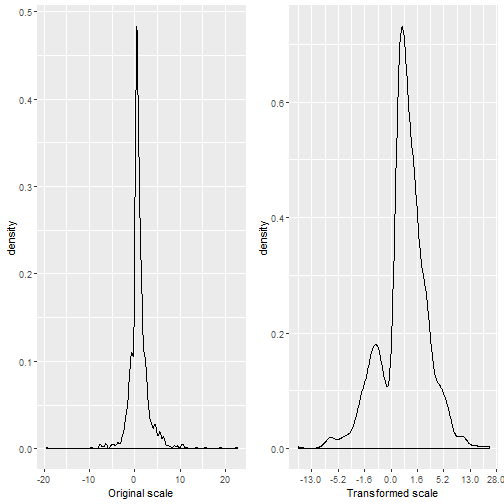
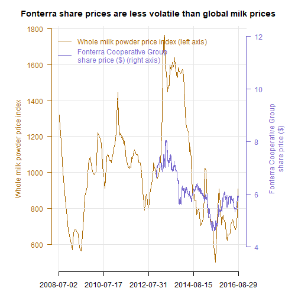

# frs-r-package
R package for miscellaneous functions associated with the [Free Range Statistics](http://freerangestats.info) blog


```r
devtools::install_github("ellisp/frs-r-package/pkg")
```

So far, the bits and pieces include:

- dual axis plots
- so-called "modulus" transformation for ggplot2 scales, which is like a Box Cox of the absolute value then with the sign returned.  Excellent for visualising economic variables that can be zero or negative
- French death rates data in 2015
- Colour palette and ggplot2 theme for International Finance Corporation branding (disclaimer - not associated at all with the IFC, but I did use it successfully in a report for them once)
- turn levels of a factor into letters, useful for quick and dirty confidentialisation
- some ODBC database odds and ends to help with R interacting with SQL Server


## Modulus transformation
Like a Box-Cox transformation, but it works with negative numbers too:

```r
library(ggplot2)
library(frs)
eg_data <- data.frame(x = exp(rnorm(1000)) * 
               sample(c(-1, 1), 1000, replace = TRUE, prob = c(0.2, 0.8)))

p1 <- ggplot(eg_data, aes(x = x)) +
  geom_density() 

p2 <- p1 +
  scale_x_continuous("Transformed scale",
                     trans = modulus_trans(0.1),
                     breaks = modulus_breaks(lambda = 0.1))
gridExtra::grid.arrange(p1 + labs(x= "Original scale"), p2, ncol = 2)
```


                     
See my blog posts on this:

* [Creating a scale transformation](http://ellisp.github.io/blog/2015/09/05/creating-a-scale-transformation)
* [Transforming the breaks to match a scale](http://ellisp.github.io/blog/2015/09/07/transforming-breaks-in-a-scale)
                     
## Dual axis line charts

Yes, they're not as bad as you've been told!


```r
data(dairy)
data(fonterra)
# with defaults for positioning scales, but exemplifying custom colours, etc:
 dualplot(x1 = dairy$Date, y1 = dairy$WMP_Total, 
          x2 = fonterra$Date, y2 = fonterra$FCGClose,
          ylab1 = "Whole milk powder price index\n",
          ylab2 = "Fonterra Cooperative Group\nshare price ($)",
          col = c("#AA6800", "#7869CD"),
          colgrid = "grey90",
          main = "Fonterra share prices are less volatile than global milk prices")
```

```
## The two series will be presented visually as though they had been converted to indexes.
```



See my blog posts on this:

* [Dual axes time series plots may be ok sometimes after all](http://ellisp.github.io/blog/2016/08/18/dualaxes)
* [Dual axes time series plots with various more awkward data](http://ellisp.github.io/blog/2016/08/28/dualaxes2)
 
